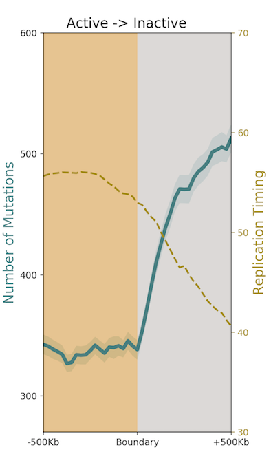
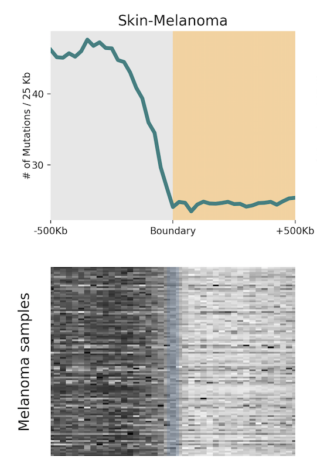
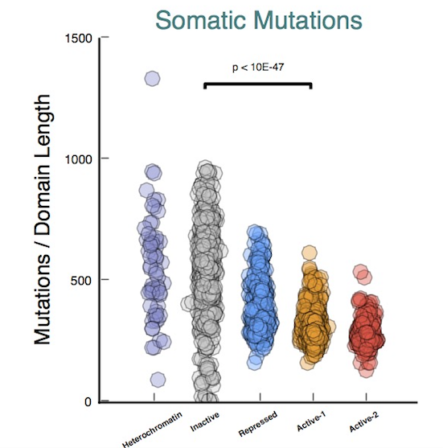
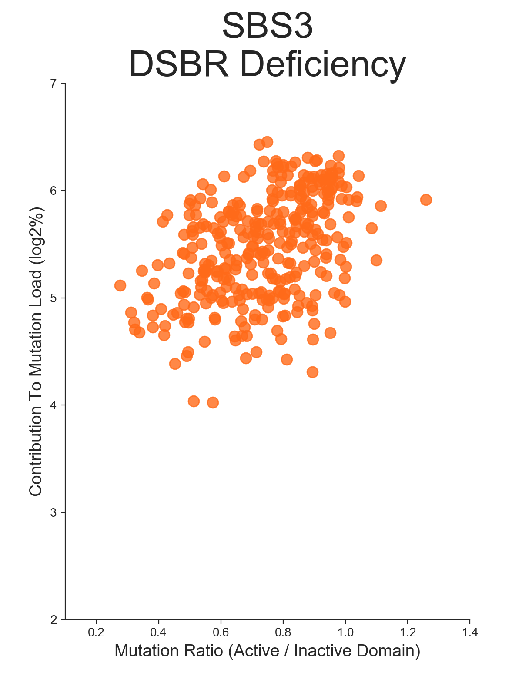
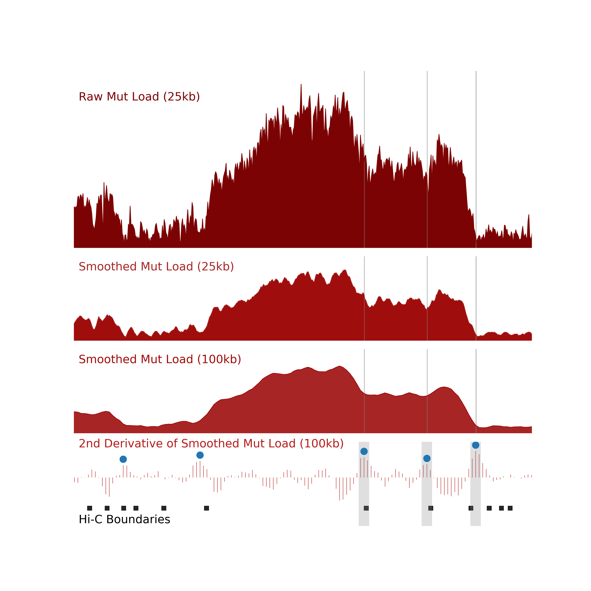
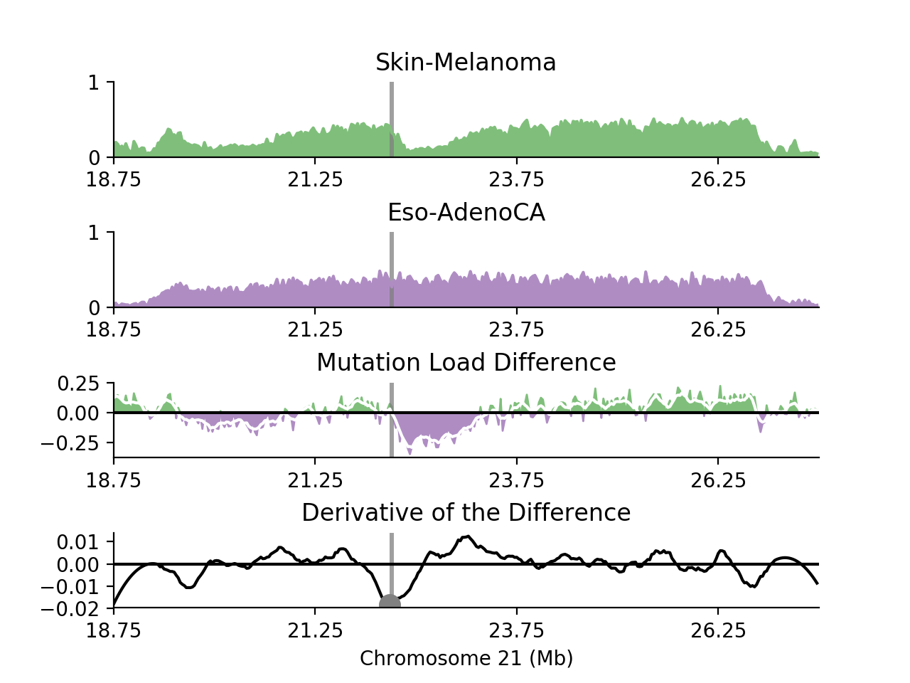

# Mutational Distribution Analysis

Somatic mutations arise during the life history of a cell. Mutations occurring in cancer driver genes may ultimately lead to the development of clinically detectable disease. Nascent cancer lineages continue to acquire somatic mutations throughout the neoplastic process and during cancer evolution. Extrinsic and endogenous mutagenic factors contribute to the accumulation of these somatic mutations. In order to understand the interplay between spatial genome organization and specific individual mutational processes, we report a study of 3000 tumor-normal pair whole genome datasets from 42 different human cancer types. This repository contains the scripts to reproduce the presented analysis in Akdemir et al.

Requirements:

Python 2.7; Numpy; Scipy; Matplotlib; Pybedtools; Seaborn

If you use these scripts in your studies, please cite our publication in Nature Genetics (https://www.nature.com/articles/s41588-020-0708-0)

## Mutation Distribution Analysis

This script -by default- plots mutation load patterns across given chromatin regions.  
In order to profile mutational distribution in individual samples use -h flag with providing a folder name including bedGraph files for individual samples.   
In order to profile mutations across chromatin domains use -d flad with providing domain annotations.

Example Usage:

python MutationAggregate.py -m Mutation.bedGraph -r Boundaries.bed -o output -n title

<figure>
  
</figure>

python MutationAggregate.py -m Mutation.bedGraph -r Boundaries.bed -f folderName -o output -n title

<figure>
  
</figure>

python MutationAggregate.py -m Mutation.bedGraph -d Domains.txt -o output -n title

<figure>
  
</figure>

## Mutation distribution analysis

To compare the mutational load distribution generated by different mutational signatures, we calculated the ratio of mutation burden in transcriptionally-inactive domains versus transcriptionally-active domains. The best fitting curve for the points of each signature was calculated with the Polynomial.fit function of Numpy library.  
This function requires a folder with bedgraph files from individual samples with -h flag, domain annotations with -d flag and a file listing the contribution of each signature's activity to the observed mutation burden in each sample with -s flag.

Example Usage:

python MutationDistribution.py -f folderName -d domains.txt -s signatureCont.txt -o output

**I will add input file format information for this script, please check back in a while if you plan to use this script.

<figure>
  
</figure>

## Identifying significantly change in mutational load

To identify the genomic loci where there is a significant shift in mutational load patterns, this scripts smooths this mutational load and calculates the second derivative of the smoothed mutational load data. Local maxima of the second derivative signal was calculated with Scipy package’s find_peak function. 

Example Usage:

python SignificantChange.py -m Mutation.bedGraph -o output

<figure>
  
</figure>

## Estimating local chromatin conformation changes via mutational load differences
In order to estimate the local chromatin conformation changes by mutational load differences between two cancer types, this script scans the genome with 10Mb non-overlapping windows. For each window, it normalizes the mutation load in CancerA and CancerB between 0 to 1 because of the number of mutation differences between these two cohorts. Next, it subtractes these normalized mutation loads and smoothed this difference signal with 1Mb genomic window. It calculates the first derivative of this smoothed mutational load difference. Local maxima and minima of the first derivative signal were calculated with Scipy package’s find_peak function with a high cut-off of 0.01. 

Example Usage:

python MutLoadCompare.py -a CancerA.bedGraph -b CancerB.bedGraph -o output

<figure>
  
</figure>

## Input Files 

We provided example input files in this repository. Please check the structure of these examples to prepare input files. 

## BedGraph

Please use the following bedGraph format for the scripts above.
	
	
	chromA  chromStartA  chromEndA  dataValueA
	chr1	10000		 10500		10.0

4th column must be a floating number.
 
* The default resolution of the bedgraph files is 25kb. If need to change it, one would need to edit scripts by searching "resolution" parameter.  
** We are actively updating this repository for providing more details about the scripts and the analyses. Please open issues for your comments/questions.
